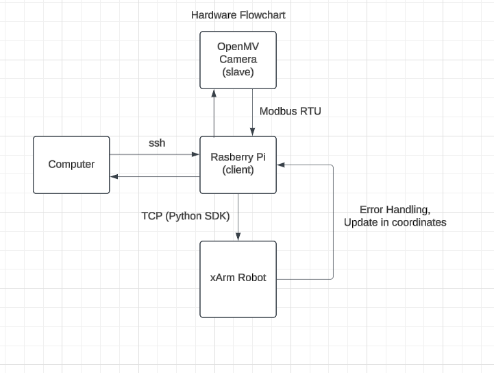
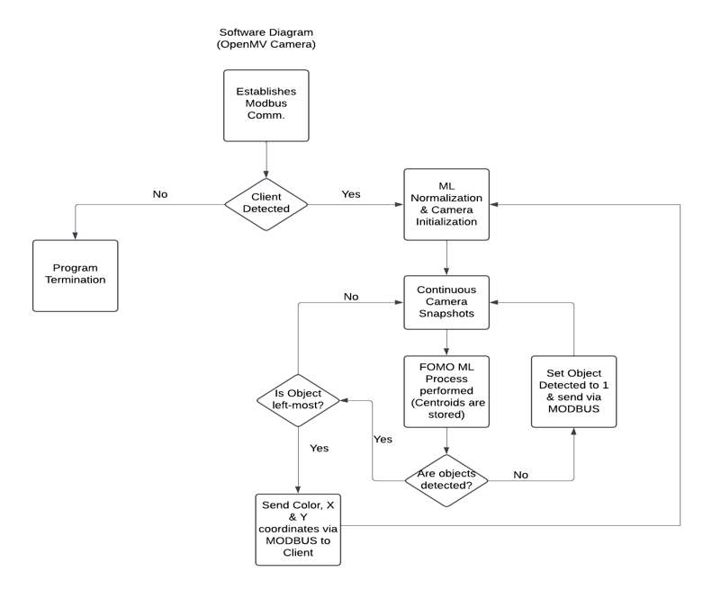
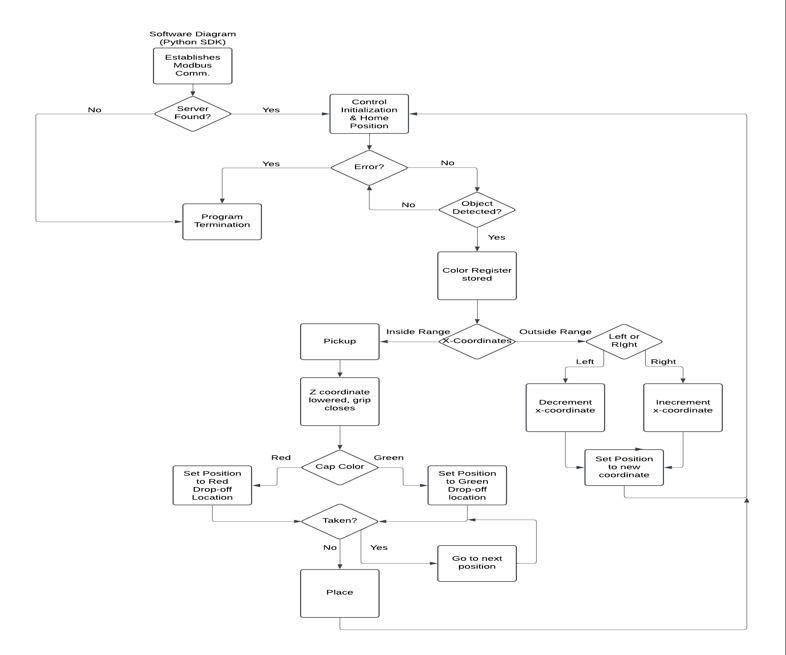

# xArm5_Color_Sorting_Project

This project aims to implement object tracking and color classification capabilities to the UFactory robot xArm5. This is achieved by running a OpenMV H7 smart camera which is running a convolutional neural network on device for color inferencing and center-point tracking of objects. A Raspberry Pi Zero was running on the edge in order to interface with the robot's controller using the xArm-SDK provided by UFactory. UART communication between the smart camera and the Raspberry Pi was achieved using the MODBUS RTU communication protocol.

## Hardware Interface

## Trajectory Flow Graph

## Smart Camera Algorithm

[To watch Video of Project Click Here.](https://youtu.be/3qH2PHvQEZs)
